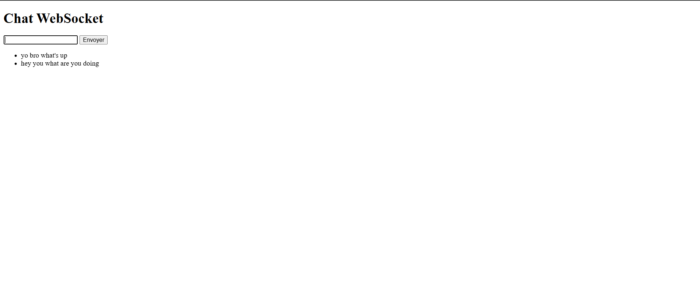
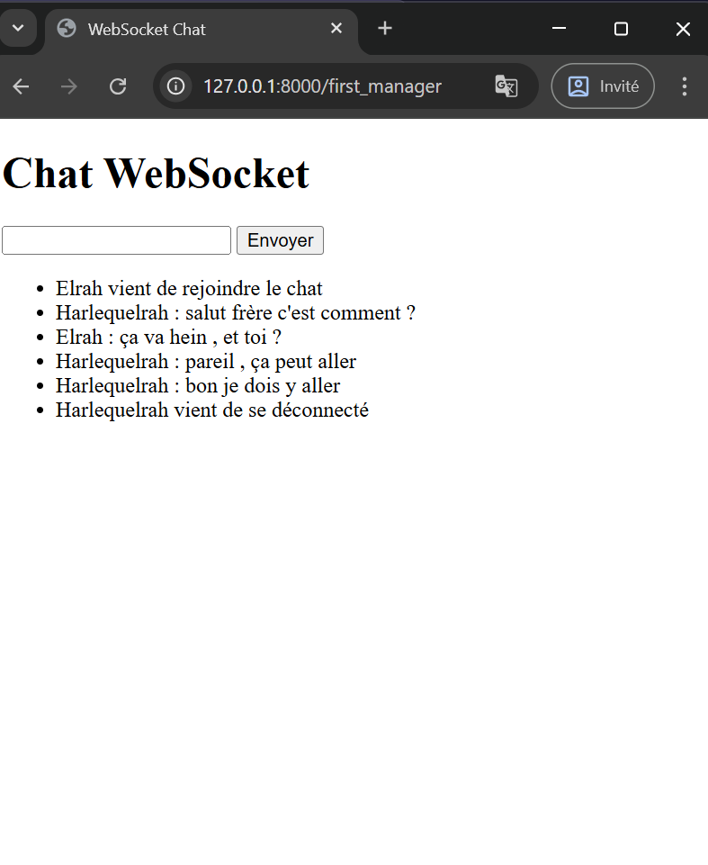
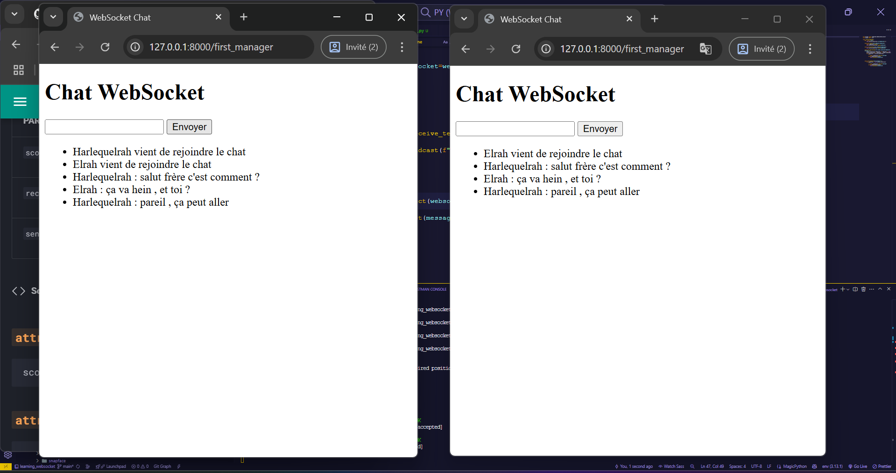
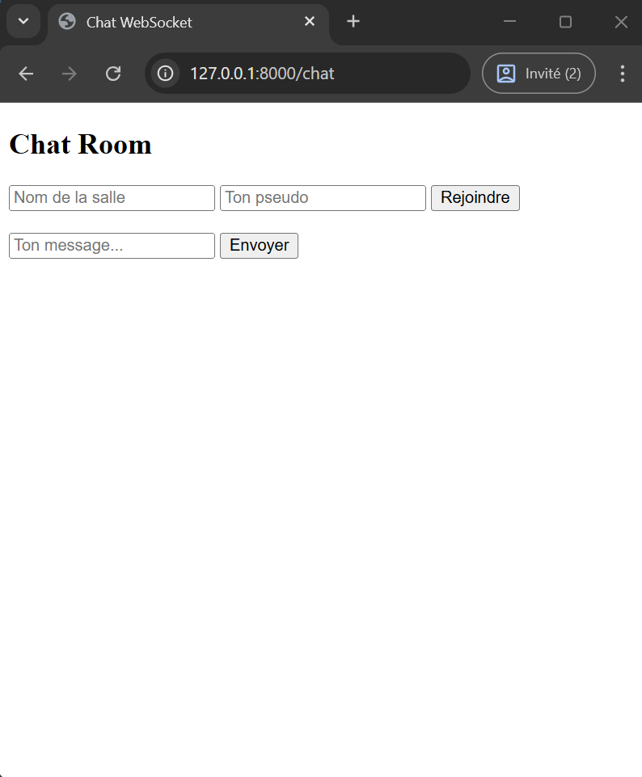
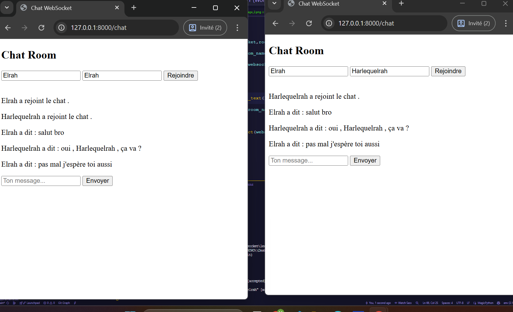
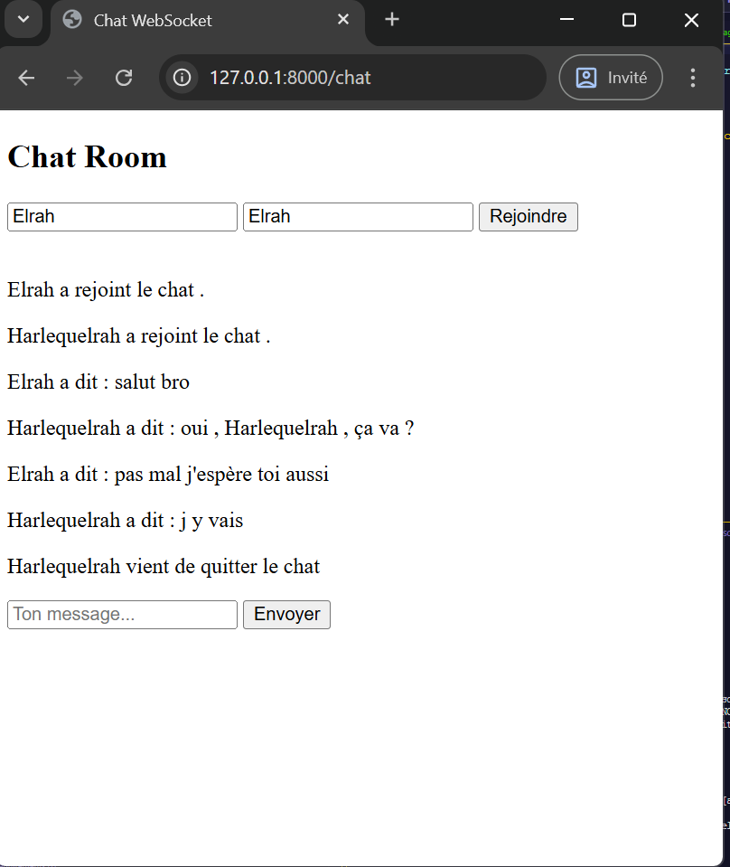

# Description

Ceci est un projet backend d'API pour apprendre à utiliser les websockets avec FASTAPI .

## Installation

- **Avec Github :**
  ```bash
  git clone https://github.com/Harlequelrah/learning_websocket
  ```

## Utilisation

- **Se rendre dans le repertoire du projet** :

```bash
  cd learning_websocket
```

-  **Création d'un environnement virtuel :**
```bash
  python -m venv env
```
ou
```bash
  virtualenv env
```

-  **Installation des dépendances :**
```bash
  pip install -r requirements.txt
```

-  **Initialisation des variables d'environnement :**
```bash
  cp .env.example .env
```

-  **Initialisation d'alembic (Optionnel) :**
```python
  alembic init alembic
```


- **Lancement du serveur :**
```python
  elrahapi run
```

## `Technologies et bibliothèques`

- ElrahAPI
- Python
- Pydantic
- FASTAPI
- SQLAlchemy

## Documentation

**`Captures :`**

]















# Contact ou Support

Pour des questions ou du support, contactez-moi .

- **`Mail`** : **maximeatsoudegbovi@gmail.com**

- **`Telephone`** : **+228 91361029**
